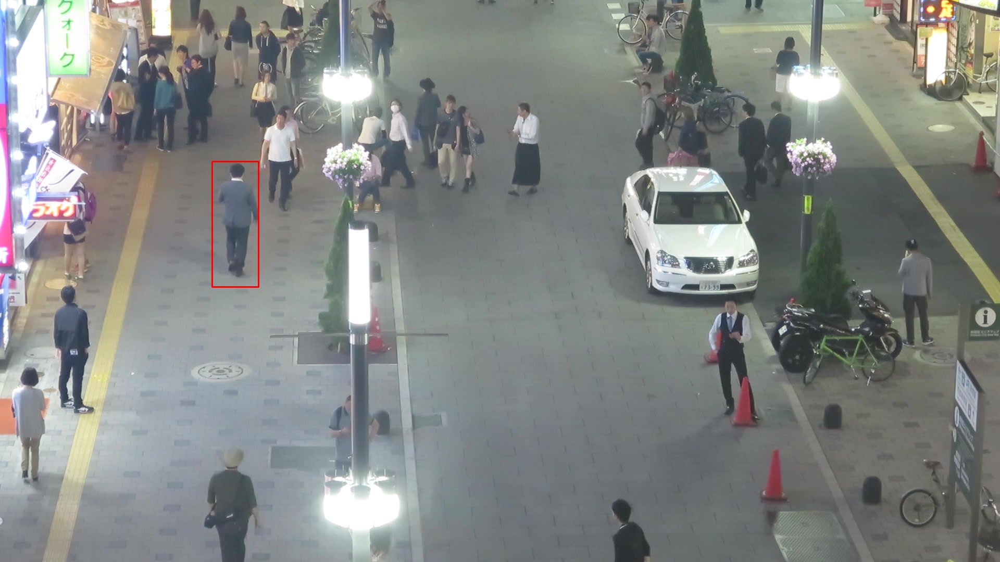
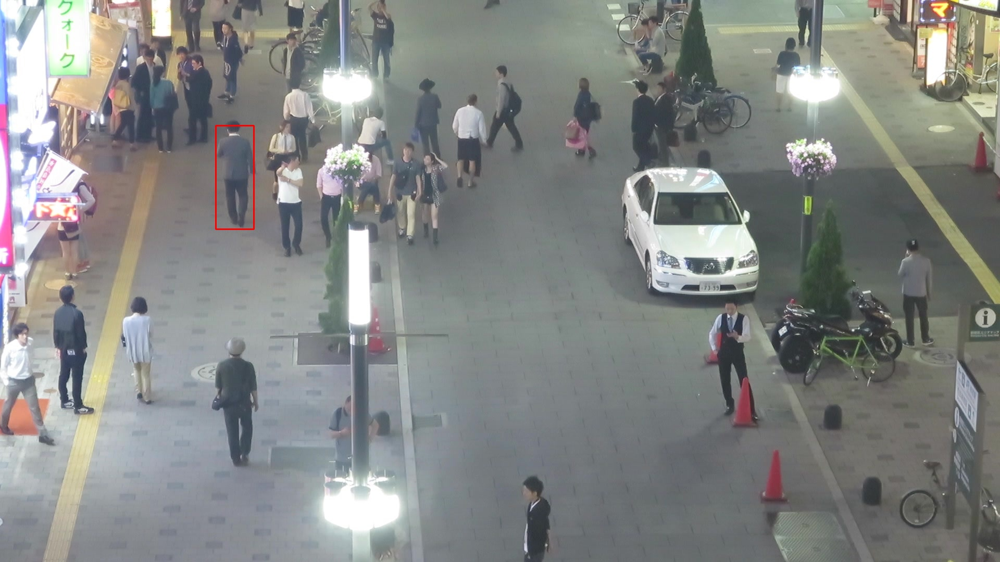
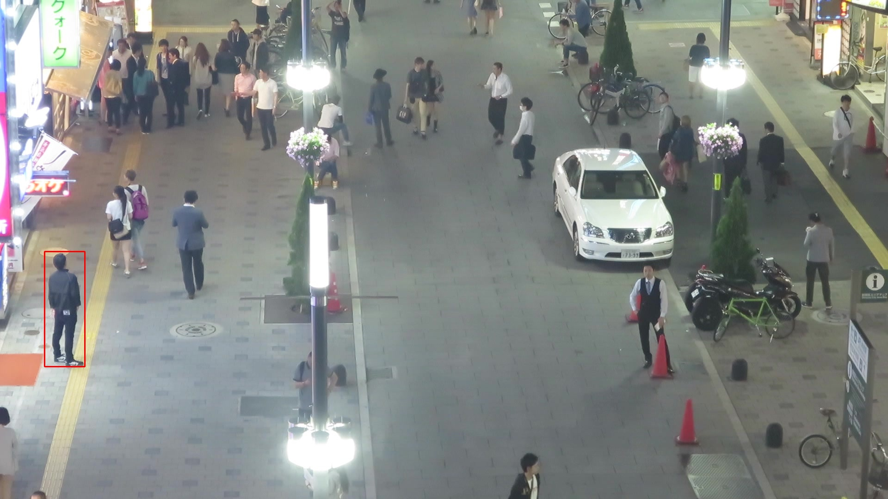
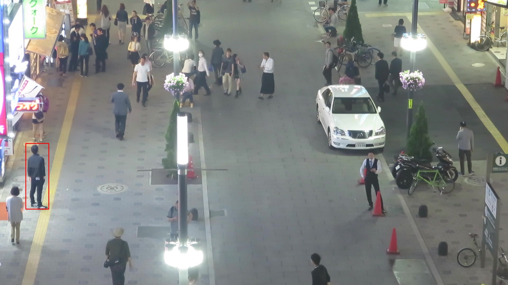
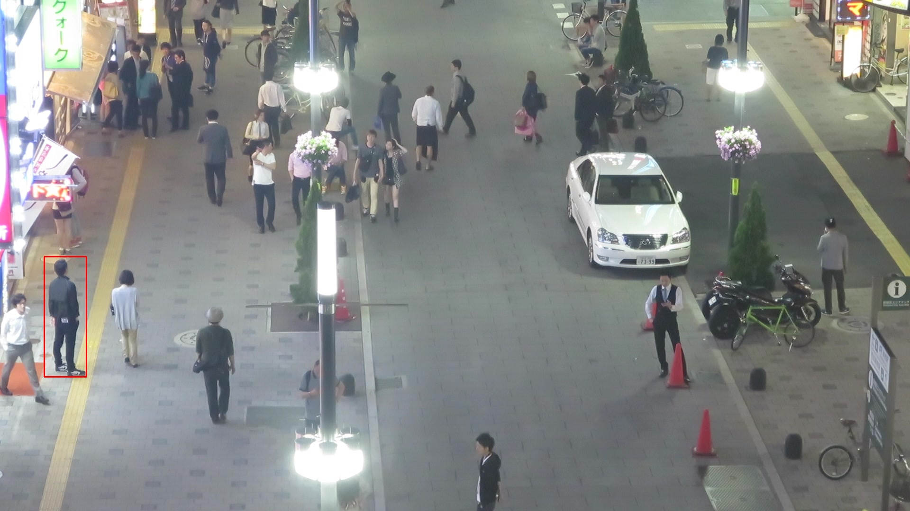
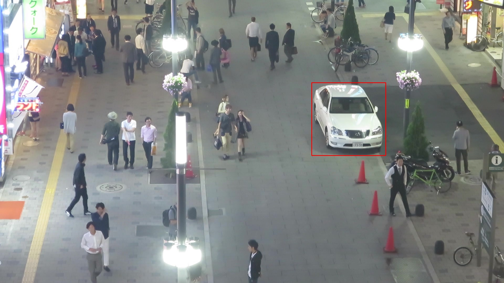

# SiameseFc_PyTorch
Siamese FC network for object tracking.

Res Dataset: MOT17-04-SDP UrL:https://motchallenge.net/data/MOT17/   
Code reference: https://github.com/huanglianghua/siamfc-pytorch
 
FC Siamese [paper.](https://arxiv.org/pdf/1606.09549.pdf)

## Metrics
 - IoU
 
 
 - Precision
 
 

## IoU/Precision
|||
|---|---|
|||

## Tracking effect
|||
|---|---|
|||
|||
|||
|||
|||
|||
|||
|||