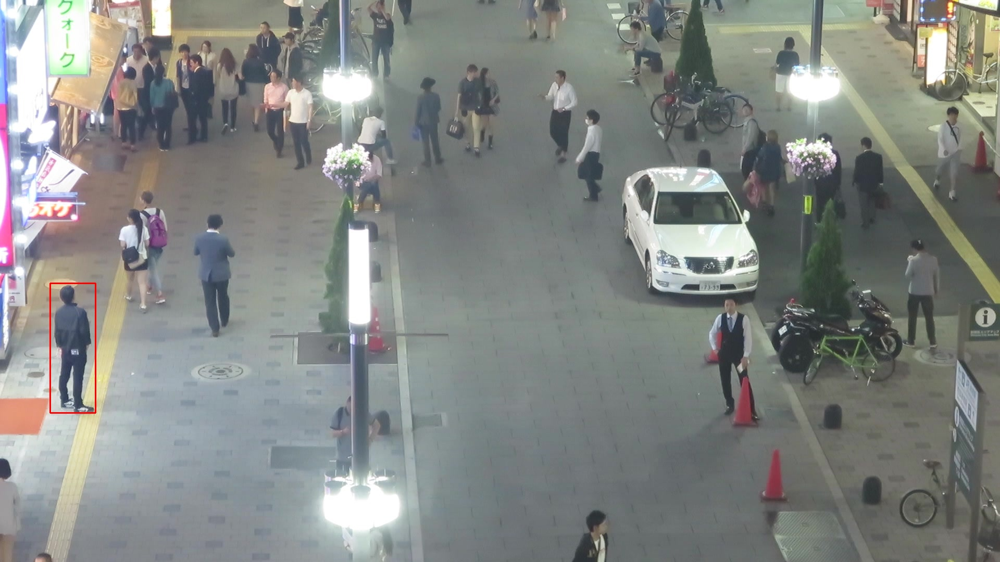
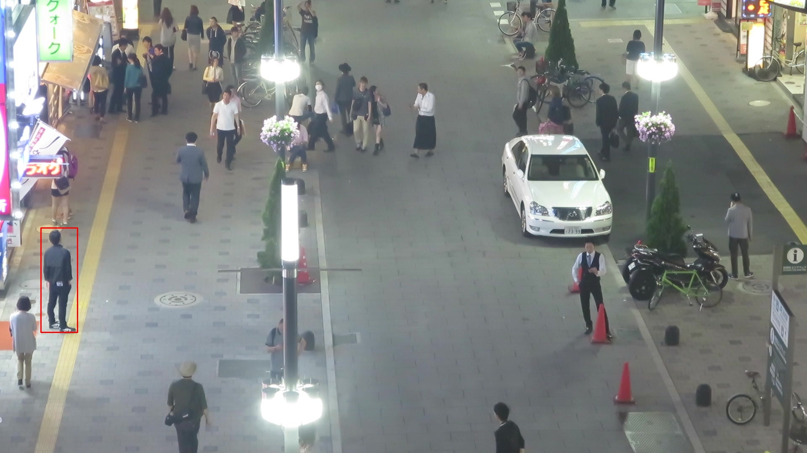
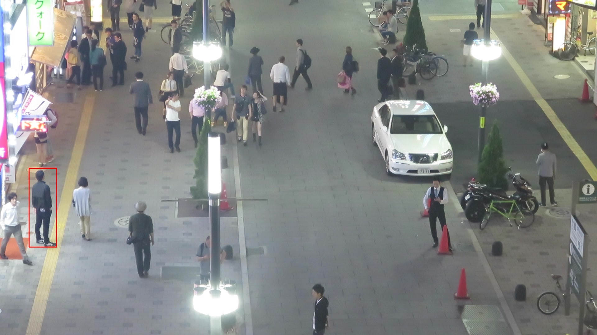
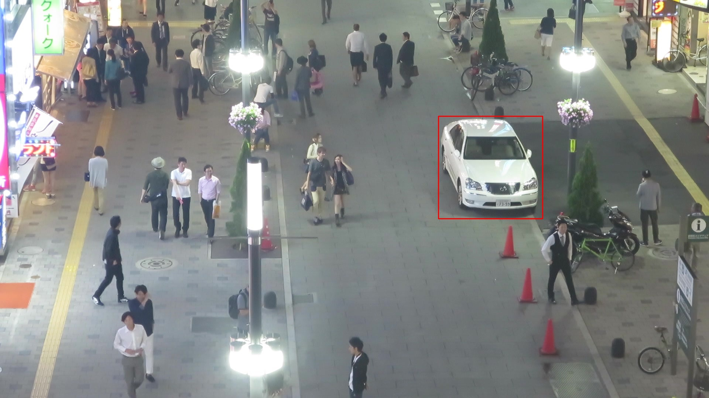

# SiameseFc_PyTorh
Siamese FC network for object tracking.

Res Dataset: MOT17-04-SDP UrL:https://motchallenge.net/data/MOT17/   
Code reference: https://github.com/huanglianghua/siamfc-pytorch

### Tracking effect
|||
|---|---|
|||
|||
|||
|||
|||
|||
|||
|||