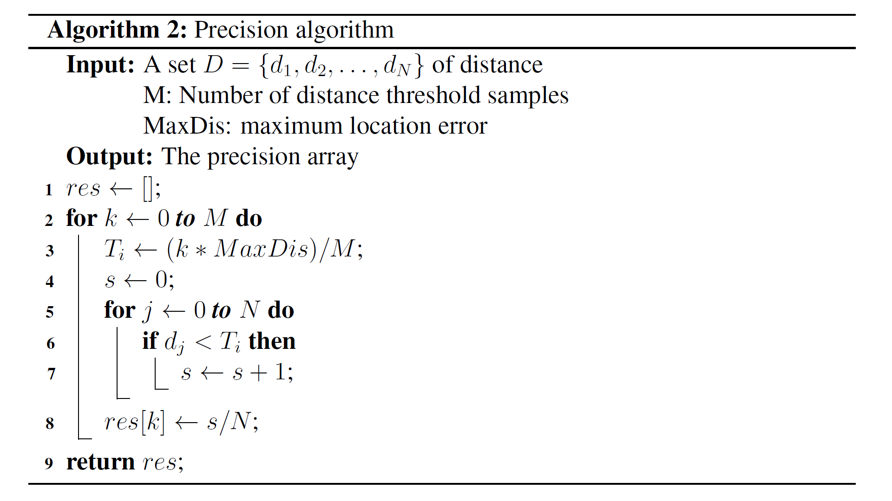

# SiameseFc_PyTorch
Siamese FC network for object/pedestrain tracking.

## References
Dataset benchmark: https://motchallenge.net/data/MOT17/   
Code reference: https://github.com/huanglianghua/siamfc-pytorch
 
FC Siamese network [paper.](https://arxiv.org/pdf/1606.09549.pdf)

## Metrics
 - Intersection over Union(IoU)
 
   
 
 - Precision
 
   
 <!-- Distance=%20\sqrt{(x_{gt}-x_{pred})^2+(y_{gt}-y_{pred})^2} -->
 <!-- Distance=%20\|C_{gt}-C_{pred} \|_{2} -->
 
## IoU/Precision plot
|||
|---|---|
|||
|||

## Tracking effect
|||
|---|---|
|||
|||
|||